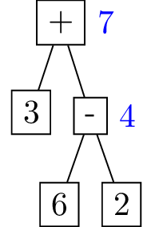
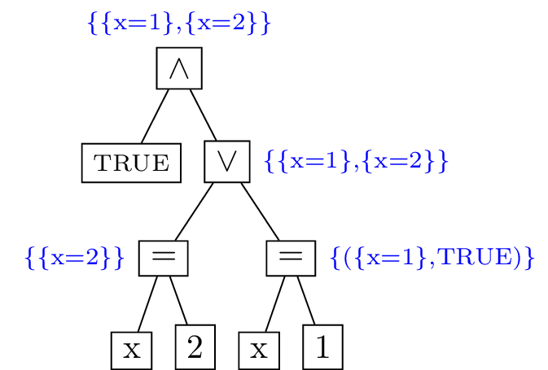

# How the TLA+ Interpreter Evaluates Expressions

The evaluation of a TLA+ expression may produce either (1) a value or (2) a set of states along with a value. The first case is the simplest to handle, and deals with basic "constant level" expressions of TLA+. The second case, dealing with how TLA+ formulas are evaluated during initial state or next state generation, is more involved, and is discussed below.

## Constant Expression Evaluation

For evaluating constant level TLA+ expressions e.g.
```
2 + 3
{1,2,3} \cup {3,4}
Append(<<1,2>>, 5)
```
we can view evaluation as a simple bottom up procedure on the parse tree of a given expression
<p align="center">

</p>
where blue values indicate the result of expression evaluation for the subtree rooted at that node.

TLA+ expressions (formulae, more generally) are also evaluated for initial state and/or next state generation, where the aim is not to produce a single value as the result of evaluation, but rather to generate a set of states satisfying the given TLA+ state (or action) predicate. 

## State Generation

It is simplest to first consider initial state generation, since next state generation is not fundamentally different. Given a set of defined variables (e.g. `VARIABLE x`) and a TLA+ formula like
```tlaplus
x = 1 \/ x = 2
```
the problem of initial state generation can be viewed as essentially a [satisfiability problem](https://en.wikipedia.org/wiki/Boolean_satisfiability_problem). That is, the goal is to generate the set of all possible assignments to state variables that make the given formula true. More generally, we can also view it as a variant of a [constraint satisfaction problem](https://en.wikipedia.org/wiki/Constraint_satisfaction_problem) (CSP), where the variable domains are initially unknown. In practice, only formulas that allow variables to range over finite domains can be handled, so we can assume that all variable domains are finite. 

Standard algorithms for satisfiability like [DPLL](https://en.wikipedia.org/wiki/DPLL_algorithm) typically assume that formulas are given in [CNF](https://en.wikipedia.org/wiki/Conjunctive_normal_form), and that the variable domains are finite and fixed upfront (e.g. boolean domains, in the case of classic SAT). In the case of state generation in TLA+, though, the setting is a bit different, since formulas may be of arbitrary form, and variables may range over finite but initially unspecified domains. Furthermore, TLA+ permits first order logical constructs (e.g. quantifiers), which fall outside the scope of classic SAT approaches. So, the algorithm for state generation can not be easily reduced to a classic backtracking/search-based satisfiability algorithm. One approach would be to encode the given TLA+ formula to SMT, and then generate the set of all satisfying assignments using a backend solver. This should be a feasible approach for both initial and next state generation, but requires work to develop a symbolic encoding for all constructs of TLA+ (e.g. see [TLAPS](https://tla.msr-inria.inria.fr/tlaps/content/Home.html) and [Apalache](https://github.com/informalsystems/apalache)). As a future experimental project, it would be interesting to see if this could be done for our interpreter e.g. by using a [browser based version of Z3](https://github.com/cpitclaudel/z3.wasm) as a backend. This may simplify the state generation algorithm significantly but would also add complexity in terms of defining the SMT encoding and ensuring its correctness.

### Basic Algorithm

The intuition behind the algorithm for state generation can be illustrated through a few basic examples. Note that our implementation aims to emulate the general approach described at a high level in Specifying Systems, section 14.2.6, to the extent possible.

A key concept of the algorithm is that of an *evaluation context*, which is the term we use in our interpreter implementation. Essentially, a context represents all of the state relevant to a single branch of a current, in-progress state generation computation. Most importantly, it stores the current assignment of values to state variables, which may be partial, or empty (e.g. no variables have values assigned yet). For simplicity of exposition, we can view a context as consisting of a pair of (1) an (partial) assignment of values to variables and (2) a TLA+ value. In practice there are a variety of other details stored in a context like what values are bound to identifiers, definitions, constants, etc. 

The core evaluation function can be viewed as taking on the following signature 
```
eval : (set<Context>, expr) -> set<Context>
```

That is, it takes in a set of contexts and an expression, and returns a new set of contexts. As an example, consider the task of generating all initial states satisfying the following TLA+ formula:

```tlaplus
TRUE /\ (x = 1 \/ x = 2)
```
Evaluation begins with a single, empty context, in which no state variables are assigned any values. If we encounter a disjunction, during evaluation, then this splits our current computation into two new branches. In the above case, we would split the computation, and then be left with one new formula in each branch. We can visualize this evaluation procedure again in tree form.

<p align="center">

</p>

Distinct from basic constant expression evaluation, the result of each subtree evaluation produces not a single TLA+ value, but a set of evaluation contexts, representing the (potentially disjunctive) formulae that were evaluated as part of that subtree. This set of contexts, representing independent branches of evaluation, are propagated up through the evaluation of the parse tree. A set of contexts may be forked many times, depending on how many disjunctive expressions appear in the formula. Also note that, for state generation, each context produces a value along with an assignment to variables, but this value must always be a boolean, representing whether or not that branch of evaluation is a permitted state.

When encountering an equality expression that contains a state variable (as shown in the lower level subtrees of the example above), this is treated as a variable assignment, and it produces an expression value of `TRUE`. If we encounter such an equality expression during evaluation and a variable has already been assigned in the current context, then it is treated as a simple boolean expression i.e. we check if the expression is satisfied based on the currently assigned variable value. 

TODO: More examples.

### Handling Disjunctions in General

Note that there are various forms of disjunction that appear in TLA+ formulas. In particular, the following three are the most common:

* `x = 1 \/ x = 2` (propositional disjunction)
* `\E v \in S : P(v)` (existential quantifier)
* `x \in S` (set membership)

Note that the third case can be expressed equivalently as `\E v \in S : x = v`, so we can consider only the first two cases. 

In practice, we require the domain `S` of quantification to be finite, so we can assume that, after evaluating `S`, we will always be quantifying over some finite set. Thus, we can reduce the existential quantifier to the propositional disjunction case. That is, if `S = {e1,...,en}` we can rewrite

```tlaplus
\E v \in S : P(v)
```
as
```tlaplus
P(e1) \/ ... \/ P(e1)
```


<!-- 
## Implementation Details

The evaluation of an initial state predicate/expression can be viewed as returning both a boolean value (`TRUE/FALSE`) as well as a set of possible states, i.e. assignments to variables that satisfy the initial state predicate. Whenever we evaluate a conjunction list 
```tla
Expr == A1 /\ ... /\ An
```
we want to compute the boolean value of each expression, and the value of `Expr` is then the conjunction of all of these boolean values. Similarly, for generating possible states, we start off with a set of currently generated (possibly partial) states, and for each of these, we go through each conjunction and evaluate it in the context of that partial state assignment, updating any assignments as necessary. For a disjunction 
```tla
Expr == A1 \/ ... \/ An
```
we split the evaluation into `n` branches. The overall boolean value of `Expr` is, similarly, the disjunction of the values of all `Ai` subformulas, but the set of possible states now becomes the union of the possible states generated by each subformula, where each subformula is given the current context to generate states from.

```javascript
expr_context = {
    // The currently computed 
    // value of an expression.
    "val": Val
    // The list of (possibly partial) states so far 
    // generated up to the current context
    // of this expression evaluation.
    "states": [State]
}
``` -->
